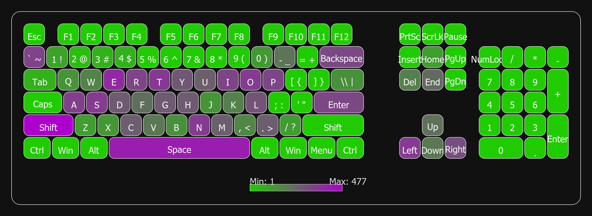

# Keyboard Heatmap

## What it does

* Logs keypress counts per session (`python -m heatmap.logger`, stop with Esc/Break).
* Merges all session JSONs into `heatmap/keyfreq.json` (`merge_sessions`).
* Renders a heatmap PNG from `keymap_104.json` and `keyfreq.json` (`renderer`).
* Outputs dated PNGs into `output_png/` (eg, `heatmap-YYYYMMDD-XX.png`).

## Requirements

* Windows with Python 3.10+
* Deps: `pillow`, `pynput` (install in a venv).

## Setup (Powershell)

```PS
cd C:\Users\<you>\path\to\keylog_heatmap
python -m venv .venv
.\.venv\Scripts\Activate.ps1
python -m pip install --upgrade pip
pip install pillow pynput
```

If activation fails: `set-ExecutionPolicy -Scope Process -ExecutionPolicy Bypass`

---

## Container Notes

* The container runs merge+render (`python main.py`) by default.
* If `heatmap/keyfreq.json` is missing, it will be created from `heatmap/keyfreq.sample.json`.
* Keylogging (`python -m heatmap.logger`) runs on the host; containers can't capture keystrokes.

### Host logging (optional - to generate your own keystroke map)

```powershell
python -m heatmap.logger # press esc/break to stop; writes heatmap/sessions/session-*.json
```

---

## Usage

1. Capture a session:

```PS
python -m heatmap.logger        # press Esc/Break to stop
```

1. Merge and render:

```PS
python main.py      # writes output_png/heatmap-YYYYMMDD-XX.png
```

Files

* `heatmap/logger.py` : Windows logger (pynput), saves to `heatmap/sessions/session-*.json`.
* `heatmap/merge_sessions.py` : Merges session JSONs into `heatmap/keyfreq.json`.
* `heatmap/renderer.py` : Renders the PNG from layout and frequencies.
* `heatmap/keymap_104.json` : ANSI 104-key layout.
* `heatmap/keyfreq.json` : Generated merged frequencies (ignored by git).
* `reset_keyfreq.py` : Clears heatmap/keyfreq.json after a Y/N prompt (sessions remain).
* `output_png/` : Generated heatmaps (ignored by git).

Packaging (Windows, planned)
From an activated venv:

```PS
python -m pip install pyinstaller
pyinstaller --onefile main.py
```

If you override fonts in `renderer.py`, include that TTF alongside the executable.

Notes.

* Run from the project root.
* `.gitignore` excludes sessions, generated PNGs, `keyfreq.json`, `__pycache__`, and `.venv`.

---

## Sample Output



---

### Project Planning Notes

Over the course of two weeks, I estimate approximately 24 hours work went into this project.

* Logging backend (pynput, stop keys, numpad mapping, etc): ~2-3 hours
* Session merge pipeline (session-*.json -> keyfreq.json, safety checks): ~1 hour
* Renderer tweaking (layout tweaks, legend/spacing, font/contrast, gamma changes): ~4 hours
* Packaging/test (PyInstaller plan, manual smoke tests: logger -> main.py): ~1-2 hours

With the rest spent on research and troubleshooting.

---

## License

Code is licensed under the GNU General Public License v3.0 (GPL-3.0).

&copy; 2025 Dom Andrewartha.
